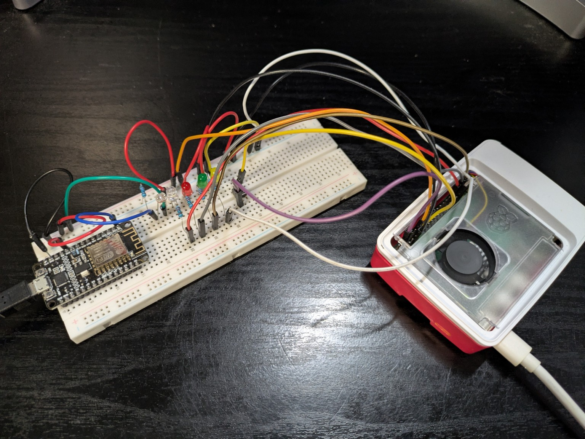

# Raspberry Pi – ESP8266 UDP Light Sensor Project

## Overview
This project implements a two-device IoT system using a Raspberry Pi and an ESP8266 NodeMCU communicating over UDP.

The Raspberry Pi acts as the controller and visualization node.  
The ESP8266 acts as a light-sensing node using an analog photoresistor.

At startup:
- All LEDs on the Raspberry Pi are OFF
- The on-board LED on the ESP8266 is OFF
- No UDP communication occurs
- The ESP8266 does not collect any sensor data

Communication is initiated only when a physical button on the Raspberry Pi is pressed.

Note:  
The ESP8266 IP address is hard-coded in the Raspberry Pi Python program.

---

## Hardware

### Raspberry Pi
- Raspberry Pi
- 1 × momentary push button
- 4 × LEDs with resistors
  - White LED (status)
  - Red LED
  - Yellow LED
  - Green LED
- Breadboard and jumper wires

### ESP8266
- ESP8266 NodeMCU
- Photoresistor (analog light sensor)
- Resistor for voltage divider
- Uses built-in LED for status indication

---

## Wiring

### Raspberry Pi
- Button connected between GPIO17 and GND
  - Configured with internal pull-up
- LEDs connected to GPIO output pins through resistors
- All LED cathodes connected to GND

### ESP8266
- Photoresistor connected as a voltage divider to A0
  - 3.3V → photoresistor → A0 → resistor → GND
- Built-in LED (GPIO2 / D4) used for flashing status

## Hardware Setup

### ESP8266 and Raspberry Pi Setup


---

## Network Configuration
- Communication protocol: UDP
- Raspberry Pi and ESP8266 must be on the same WiFi network
- ESP8266 IP address is hard-coded in Raspberry Pi code
- UDP ports must match on both devices

---

## Program Description

### Initial State
- Raspberry Pi LEDs: OFF
- ESP8266 on-board LED: OFF
- ESP8266 does not sample the light sensor
- No UDP traffic

---

### 1. First Button Press (Start Communication)

When the button connected to the Raspberry Pi is pressed:

#### Raspberry Pi
1. Turns ON the white LED
2. Sends a UDP message to the ESP8266 to initiate communication

#### ESP8266
After receiving the first UDP message:
1. Starts flashing its on-board LED every 0.5 seconds
2. Begins collecting light sensor values every 1 second
3. Stores sensor values in a rolling buffer

Once 5 seconds of data have been collected:
- Computes the average of the most recent 5 samples
- Sends the average value back to the Raspberry Pi every 2 seconds via UDP

---

### 2. Light Level Indication on Raspberry Pi

Whenever the Raspberry Pi receives a UDP packet containing sensor data:

- The received value is classified into LOW, MEDIUM, or HIGH
- LEDs are activated as follows:

| Light Level | LEDs ON |
|------------|---------|
| LOW | Red |
| MEDIUM | Red + Yellow |
| HIGH | Red + Yellow + Green |

Threshold values are defined in software.

---

### 3. Error Condition (ESP8266 Timeout)

If the Raspberry Pi does not receive any UDP message from the ESP8266 for 10 seconds:

- The Raspberry Pi enters an error state
- The white LED flashes every 0.5 seconds
- The system does not attempt to reconnect automatically
- The error state continues until the button is pressed again

---

### 4. Second Button Press (Stop and Reset)

When the button is pressed again:

#### Raspberry Pi
1. Sends a different UDP message (STOP) to the ESP8266
2. Turns OFF all RGBW LEDs

#### ESP8266
1. Stops collecting sensor data
2. Stops sending UDP packets
3. Turns OFF its on-board LED

Both devices return to their initial state.

---

## UDP Message Format

### Messages Sent from Raspberry Pi
- `START`  
  Initiates communication and enables sensor sampling on ESP8266

- `STOP`  
  Stops sensor sampling and resets ESP8266

### Messages Sent from ESP8266
- `DATA:<average_value>`  
  Contains the rolling average of the last 5 seconds of sensor readings

---

## Project Structure
```
udp_light_project/
├── esp_code/
│ ├── ESP_Server.ino
│ ├── ESP_UDP_Receiver.ino
│ ├── ESP_UDP_Sender.ino
│ └── ESP_UDP_Ping.ino
└── pi_code/
├── pi_client.py
├── udp_sender.py
├── udp_receiver.py
└── button_udp_sender.py
```

---

## File Responsibilities

### Raspberry Pi (Python)

#### pi_client.py
- Main control program
- Initializes GPIO for button and LEDs
- Sends START and STOP UDP messages
- Receives sensor data
- Controls LED behavior
- Detects ESP8266 timeout and triggers error state

#### udp_sender.py
- Sends UDP packets to the ESP8266

#### udp_receiver.py
- Listens for UDP packets from the ESP8266
- Parses incoming sensor data

#### button_udp_sender.py
- Handles button press events
- Triggers START and STOP logic

---

### ESP8266 (Arduino C++)

#### ESP_Server.ino
- Main ESP8266 logic
- Handles WiFi connection
- Coordinates UDP receive and send logic

#### ESP_UDP_Receiver.ino
- Receives START and STOP commands from Raspberry Pi

#### ESP_UDP_Sender.ino
- Sends averaged sensor data back to Raspberry Pi via UDP

#### ESP_UDP_Ping.ino
- Handles basic UDP connectivity and keep-alive behavior

---

## Build & Upload

### ESP8266
1. Open `ESP_Server.ino` in Arduino IDE
2. Install ESP8266 board support
3. Select the correct NodeMCU board and COM port
4. Configure WiFi credentials and UDP ports in code
5. Upload the sketch
6. Open Serial Monitor at 115200 baud

### Raspberry Pi
1. Ensure Python 3 is installed
2. Install required Python libraries:
   - gpiozero
3. Update ESP8266 IP address and UDP ports in Python files
4. Run:
   ```bash
   python3 pi_client.py
## Expected Results
- ESP8266 does not sample sensor data until the START message is received from the Raspberry Pi
- ESP8266 flashes its on-board LED every 0.5 seconds during normal operation
- Light sensor data is averaged over a 5 second window and transmitted to the Raspberry Pi every 2 seconds
- Raspberry Pi RGB LEDs indicate LOW, MEDIUM, and HIGH light levels based on received sensor data
- Loss of communication for more than 10 seconds triggers a flashing white LED error state on the Raspberry Pi
- Pressing the button a second time stops communication and resets both devices to the initial state

---

## Author
Pham Kim Quy  
Raspberry Pi UDP Lab

